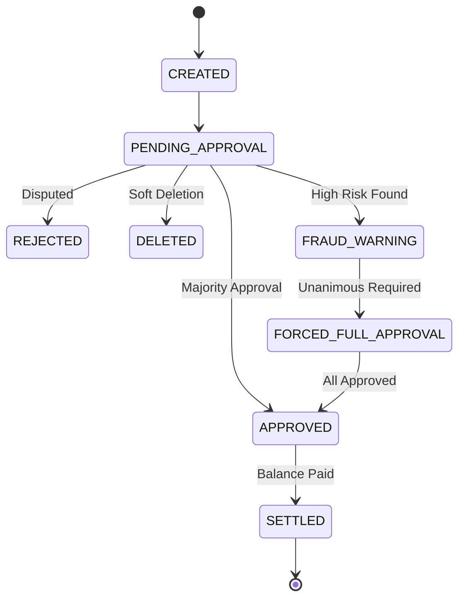
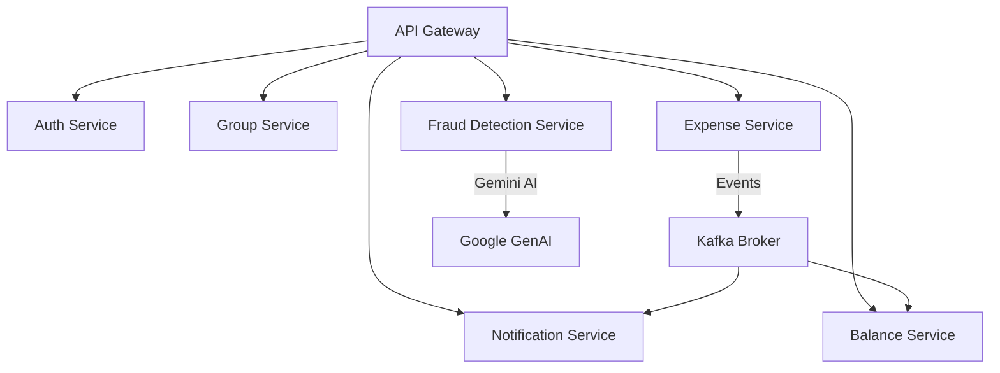

# Product Requirements Document (PRD)
## SplitSmart – Fraud-Resistant Expense Splitting Platform

---

## 1. Product Overview
**Product Name:** SplitSmart

SplitSmart is a web-based expense sharing platform that allows groups of people to track and split shared expenses transparently while minimizing fraud and disputes. The product aims to provide the core functionality of apps like Splitwise while introducing strong trust mechanisms such as:
- **Group expense approval workflows**
- **Fraud detection** using rule-based + AI analysis
- **Optional receipt verification**
- **Suspicious expense warnings** and forced approvals
- **Audit-safe soft deletion** of expenses

The system is designed to scale to millions of users and support large numbers of groups and expense transactions.

---

## 2. Problem Statement
Managing shared expenses among groups often leads to confusion, disputes, and lack of trust due to:
1. **Incorrect or manipulated** expense entries.
2. **Duplicate or inflated** expenses.
3. **Lack of transparency** when editing or deleting expenses.
4. **Difficulty calculating** who owes whom.
5. **Lack of verification** mechanisms.

Most existing expense-sharing applications rely heavily on user trust without built-in fraud prevention. SplitSmart aims to solve this by introducing verification layers, approval systems, and automated fraud detection.

---

## 3. Goals and Objectives

### Primary Goals
1. Provide a reliable platform for splitting expenses among groups.
2. Prevent fraudulent or suspicious expense entries.
3. Improve trust among group members through transparent approval workflows.
4. Maintain accurate debt balances between users.
5. Support millions of users with high availability.

### Success Metrics
| Metric | Target |
| :--- | :--- |
| **Active Users** | Month-over-month growth |
| **Groups Created** | High engagement per user |
| **Approval Rate** | Success rate of pending transactions |
| **AI Accuracy** | Precision of fraud detection signals |
| **Response Time** | API latency < 200ms |
| **System Uptime** | 99.9% availability |

---

## 4. Target Users

### Primary Users
- Friends on trips
- Roommates sharing living expenses
- College groups
- Event organizers
- Small teams splitting costs

### User Personas
- **Traveler Group**: Track hotel, food, and travel expenses.
- **Roommates**: Monthly rent, utilities, and groceries.
- **Event Planner**: Tracks decorations, food, and tickets.

---

## 5. Key Features & Implementation Status

### 5.1 System Modules
| Module | Feature | Description | Status |
| :--- | :--- | :--- | :--- |
| **Account** | Management | Register, Login, Profile, Activity history. | [x] |
| **Group** | Management | Create groups, Invite/Remove members, View balances. | [x] |
| **Expense** | Core Logic | Title, Description, Amount, Payer, Category. | [x] |
| **Approval** | Workflow | Majority-based approval required for balance updates. | [x] |
| **Fraud** | Hybrid Engine | Rule-based + AI (Gemini) analysis for risk scoring. | [x] |

### 5.2 Expense Lifecycle

---

## 6. Trust & Verification

### 6.1 Fraud Detection System
SplitSmart includes a hybrid fraud detection system:
- **Rule-Based**: Large expenses without receipts, duplicate detections, average variance.
- **AI-Based**: Powered by **Spring AI + Gemini** to evaluate description credibility and unusual behavior.

### 6.2 Forced Approval Trigger
If the fraud score crosses a defined threshold:
1. A **warning** is shown to all participants.
2. The expense enters a `FRAUD_WARNING` state.
3. The system requires **unanimous** approval from all participants.
4. Receipt upload is strongly recommended.

### 6.3 Soft Deletion (Audit-Safe)
Expenses are never permanently removed.
1. Status changes to `DELETED`.
2. Content remains stored for auditing (Historical transparency).
3. **Fraud detection runs immediately** after deletion to prevent suspicious patterns.

---

## 7. Debt & Settlement Tracking
- **Debt Tracking**: Maintains balances between users to avoid heavy recalculations. Updated upon approval or settlement.
- **Settlement**: Mark debts as `SETTLED` once external payment (UPI, cash) is confirmed.

---

## 8. Technical Architecture

### 8.1 System Diagram

### 8.2 Technology Stack
- **Frontend**: Next.js / React (Modern Premium UI)
- **Backend**: Spring Boot Microservices
- **AI**: Spring AI + Gemini
- **Database**: MySQL
- **Messaging**: Apache Kafka (Asynchronous Fraud/Notifications)

---

## 9. Non-Functional Requirements
- **Scalability**: Support millions of users/records.
- **Performance**: API response < 200 ms.
- **Security**: RBAC, Encrypted passwords, Audit logs (F29).
- **Reliability**: Fault tolerance via microservices & Eureka.

---

## 10. Roadmap & Future
- **OCR Receipt Verification**: Automated data extraction.
- **Settlement Optimization**: Algorithms to minimize transaction counts.
- **Mobile Application**: Native iOS/Android apps.
- **Advanced Analytics**: Dashboards for group spending trends.

---

## 11. Product Summary
SplitSmart provides a reliable, fraud-resistant expense sharing platform that improves trust and transparency within groups. Key differentiators include majority-based approvals, hybrid AI fraud detection, and a secure, audit-safe lifecycle.
