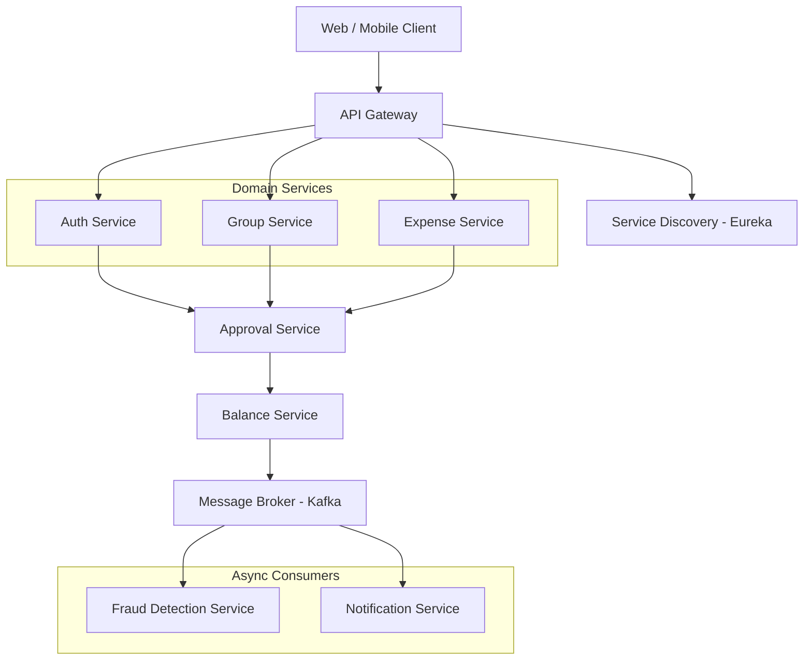

# High-Level Design (HLD)
## SplitSmart – Fraud-Resistant Expense Splitting Platform

---

## 1. Introduction
This document describes the High-Level Design (HLD) of the SplitSmart platform. SplitSmart is a fraud-resistant expense sharing application that allows users to create groups, track shared expenses, approve expenses collaboratively, and detect suspicious financial activity.

The system follows a microservices architecture where each service manages a specific domain. The architecture is designed to support scalability, maintainability, and independent deployment of services.

### Key Technologies
- **Framework**: Spring Boot 3.x
- **Registry**: Spring Cloud Netflix Eureka
- **Gateway**: Spring Cloud Gateway
- **Security**: Spring Security + JWT
- **Messaging**: Apache Kafka
- **Database**: MySQL 8.0
- **Cache**: Redis

---

## 2. Architecture Overview
SplitSmart uses a microservices-based architecture with independent domain services and event-driven communication.

### System Diagram

---

## 3. Core Infrastructure Services

### 3.1 Service Discovery (Eureka)
The discovery server maintains a registry of all running microservices, enabling dynamic location and health monitoring.

### 3.2 API Gateway
The single entry point for all client requests, responsible for routing, security enforcement, and rate limiting.

| Route Pattern | Target Service |
| :--- | :--- |
| `/auth/**` | Auth Service |
| `/groups/**` | Group Service |
| `/expenses/**` | Expense Service |

---

## 4. Microservices Breakdown

### 4.1 Auth Service
Handles user lifecycle, registration, and JWT issuance.
- **Tables**: `Users`, `Roles`, `UserRoles`.

### 4.2 Group Service
Manages group boundaries, memberships, and dashboard summaries.
- **Tables**: `Groups`, `GroupMembers`.

### 4.3 Expense Service
The core business hub for creating and managing transactions.
- **Tables**: `Expenses`, `ExpenseParticipants`, `ExpenseReceipts`.
- **Events**: `ExpenseCreated`, `ExpenseUpdated`, `ExpenseDeleted`.

### 4.4 Approval Service
Orchestrates the majority-based voting system.
- **Logic**: 50%+ for standard; 100% for high-risk.

### 4.5 Balance Service
Maintains the peer-to-peer debt matrix. Updates balances upon final approval of expenses or settlements.

### 4.6 Fraud Detection Service
Uses rule-based checks and **Google Gemini AI** to score transactions.
- **Triggers**: Creation, Edits, Deletions.

### 4.7 Notification Service
Dispatches alerts via WebSockets, Email, or Push for critical state changes.

---

## 5. Communication Patterns

### 5.1 Synchronous (REST)
Used for immediate user actions (e.g., Login, Creating an Expense).
- **Tech**: HTTP/JSON via Feign Clients.

### 5.2 Asynchronous (Event-Driven)
Used for background tasks to avoid blocking the main UI thread.
- **Tech**: Apache Kafka.
- **Flow**: `ExpenseCreated` -> `Kafka` -> `Fraud/Notification/Balance`.

---

## 6. Database & Caching
- **Database-per-Service**: Each microservice manages its own MySQL instance for loose coupling.
- **Redis Layer**: Used for session caching, rate limiting, and frequent query optimization.

---

## 7. Scalability & Security

### Scalability Strategy
- **Horizontal Scaling**: Multiple instances behind the Gateway.
- **Asynchronous Processing**: Non-blocking fraud detection pipeline.
- **Caching**: Drastic reduction in DB load via Redis.

### Security Architecture
- **JWT Authentication**: Stateless token-based security.
- **RBAC**: Role-Based Access Control at the service level.
- **Traffic Filtering**: Centralized security at the API Gateway.

---

## 8. Conclusion
The SplitSmart architecture leveraging Spring Boot, Kafka, and a decentralized database strategy ensures high reliability and performance under load, while the AI-driven fraud pipeline provides a unique competitive advantage in the expense-sharing market.
